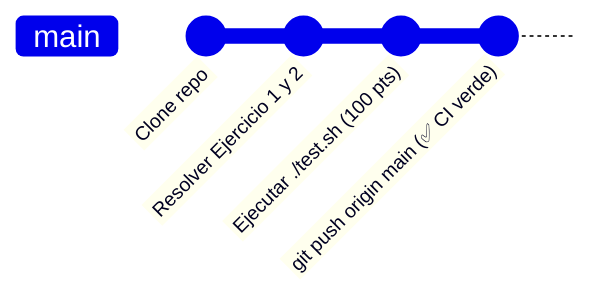

# 📖 Cheatsheet: Guía Rápida de Comandos — Linux Shell y Git

> **Sistemas Operativos II — Ciclo Lectivo 2026**  
> **Cátedra:** Ing. María Fernanda Vázquez | Ing. Fabio Damián Argañaraz Azua  
> **Propósito:** Hoja de referencia rápida para el desarrollo de los Trabajos Prácticos en **Git Bash** y terminales Linux.

---

## 1. 📂 Navegación y Gestión del Sistema de Archivos

| Comando | Descripción | Ejemplo de Uso |
| :--- | :--- | :--- |
| `pwd` | Muestra la ruta del directorio de trabajo actual (*Print Working Directory*). | `pwd` |
| `ls` | Lista archivos y carpetas del directorio. | `ls` |
| `ls -la` | Lista en formato largo (`-l`), mostrando archivos ocultos (`-a`) y permisos. | `ls -la` |
| `ls -lh` | Lista en formato largo con tamaños legibles para humanos (`KB`, `MB`, `GB`). | `ls -lh` |
| `cd <ruta>` | Cambia el directorio actual. | `cd soluciones/` |
| `cd ..` | Sube un nivel al directorio padre. | `cd ..` |
| `cd ~` o `cd` | Va directamente al directorio personal del usuario (`$HOME`). | `cd ~` |
| `mkdir <dir>` | Crea uno o varios directorios. | `mkdir entorno` |
| `mkdir -p <ruta>` | Crea directorios y todas sus subcarpetas intermedias si no existen. | `mkdir -p entorno/config/backup` |
| `touch <archivo>` | Crea un archivo vacío o actualiza su fecha de modificación. | `touch app.conf` |
| `cp <origen> <dest>` | Copia archivos. | `cp datos.txt copia.txt` |
| `cp -r <orig> <dest>` | Copia directorios de manera recursiva. | `cp -r carpeta/ respaldo/` |
| `mv <origen> <dest>` | Mueve o renombra archivos y directorios. | `mv viejo.txt nuevo.txt` |
| `rm <archivo>` | Elimina un archivo. | `rm temporal.log` |
| `rm -rf <dir>` | Elimina un directorio y todo su contenido de forma forzada y recursiva. | `rm -rf carpeta_obsoleta/` |

---

## 2. 📝 Visualización y Procesamiento de Archivos de Texto

| Comando | Descripción | Ejemplo de Uso |
| :--- | :--- | :--- |
| `cat <archivo>` | Muestra todo el contenido de un archivo por pantalla. | `cat /etc/passwd` |
| `head -n <N> <arch>` | Muestra las **primeras N líneas** de un archivo (por defecto 10). | `head -n 15 servidores.log` |
| `tail -n <N> <arch>` | Muestra las **últimas N líneas** de un archivo (por defecto 10). | `tail -n 10 accesos.log` |
| `wc -l <archivo>` | Cuenta la cantidad de **líneas** de un archivo o entrada estándar. | `wc -l datos.csv` |
| `wc -w <archivo>` | Cuenta la cantidad de **palabras**. | `wc -w texto.txt` |
| `wc -c <archivo>` | Cuenta la cantidad de **bytes**. | `wc -c binario.dat` |
| `grep "<patron>" <arch>` | Filtra y muestra líneas que contienen el texto o expresión regular. | `grep "ERROR" servidores.log` |
| `grep -i "<patron>"` | Búsqueda insensible a mayúsculas y minúsculas (*case-insensitive*). | `grep -i "warning" log.txt` |
| `grep -v "<patron>"` | Invierte la búsqueda: muestra las líneas que **NO** coinciden. | `grep -v "^#" config.conf` |
| `cut -d'<sep>' -f<col>` | Corta y extrae columnas delimitadas por un carácter separador. | `cut -d',' -f2 usuarios.csv` |
| `sort` | Ordena las líneas alfabéticamente de la A a la Z. | `sort lista.txt` |
| `sort -r` | Ordena en sentido inverso (Z a A). | `sort -r nombres.txt` |
| `sort -n` | Ordena numéricamente. | `sort -n numeros.txt` |
| `sort -u` | Ordena y **elimina duplicados** directamente. | `sort -u ips.txt` |
| `uniq` | Elimina líneas duplicadas consecutivas (requiere datos previamente ordenados). | `sort ips.txt \| uniq` |
| `uniq -c` | Cuenta la cantidad de ocurrencias de cada línea duplicada. | `sort rutas.txt \| uniq -c` |
| `tr -d '<caracter>'` | Elimina caracteres específicos de la entrada estándar. | `tr -d '\r' < archivo.txt` |

---

## 3. 🔀 Flujos Estándar, Redirecciones y Tuberías (*Pipes*)

En los sistemas tipo UNIX/Linux existen tres flujos de datos estándar:
* **`stdin` (0):** Entrada estándar (teclado o entrada redirigida).
* **`stdout` (1):** Salida estándar (pantalla o archivo de salida).
* **`stderr` (2):** Salida de errores estándar (mensajes de error).

### Operadores de Redirección

| Operador | Significado | Ejemplo |
| :---: | :--- | :--- |
| `>` | **Sobrescribe** la salida estándar a un archivo. Si no existe, lo crea; si existe, lo borra y reemplaza. | `echo "Hola Mundo" > saludo.txt` |
| `>>` | **Anexa (*append*)** la salida estándar al final del archivo sin borrar lo anterior. | `echo "Nueva linea" >> registro.log` |
| `<` | **Redirige la entrada estándar** desde un archivo en lugar del teclado. | `wc -l < servidores.log` |
| `2>` | Redirige únicamente los **mensajes de error (`stderr`)** a un archivo. | `ls /directorio_inexistente 2> error.log` |
| `2>&1` | Redirige los errores al mismo destino que la salida estándar. | `comando > salida.log 2>&1` |
| `\|` | **Tubería (*Pipe*):** Conecta la salida estándar del comando izquierdo con la entrada estándar del comando derecho. | `cat log.txt \| grep "ERROR" \| wc -l` |

### 💡 Ejemplos Clásicos de Tuberías en Práctica

```bash
# 1. Filtrar errores, extraer la IP (2da columna) y listar IPs únicas:
grep "ERROR" datos/servidores.log | cut -d' ' -f2 | sort -u > soluciones/ips_error.txt

# 2. Filtrar usuarios de Sistemas activos y ordenar sus nombres:
grep ",Sistemas,true" datos/usuarios.csv | cut -d',' -f2 | sort > soluciones/activos.txt

# 3. Obtener la cantidad de líneas limpias sin que wc imprima el nombre del archivo:
wc -l < datos/servidores.log | tr -d ' ' > soluciones/total_lineas.txt
```

---

## 4. 🔒 Permisos de Archivos y Scripts Ejecutables (`chmod`)

En Linux, cada archivo tiene 3 tipos de permisos sobre 3 entidades:
* **Entidades:** Propietario/Usuario (`u`), Grupo (`g`), Otros/Resto (`o`), Todos (`a`).
* **Permisos:** Lectura (`r` = 4), Escritura (`w` = 2), Ejecución (`x` = 1).

### Modo Simbólico

```bash
# Dar permisos de ejecución al propietario:
chmod u+x script.sh

# Dar permisos de ejecución a todos los usuarios:
chmod +x test.sh ejercicios.sh

# Asignar solo lectura a dueño, grupo y otros:
chmod a=r archivo.txt
```

### Modo Numérico / Octal

| Valor Octal | Permisos Resultantes | Significado Común |
| :---: | :---: | :--- |
| `755` | `rwxr-xr-x` | Dueño con control total; grupo y otros solo lectura y ejecución (estándar para scripts y directorios). |
| `644` | `rw-r--r--` | Dueño lee y escribe; grupo y otros solo leen (estándar para archivos de texto y código). |
| `700` | `rwx------` | Solo el dueño tiene acceso total; nadie más puede leer ni ejecutar (claves privadas, `/root`). |
| `540` | `r-xr-----` | Dueño lee y ejecuta; grupo solo lee; otros sin acceso. |
| `400` | `r--------` | Solo lectura exclusiva para el dueño. |

---

## 5. 🛠️ Creación de Scripts en Bash (*Scripting Básico*)

Todo script en Bash debe comenzar con la línea de *shebang*:

```bash
#!/usr/bin/env bash

# Variables y comandos del sistema
FECHA_ACTUAL=$(date)
USUARIO_ACTUAL=$(whoami)

echo "=== REPORTE DEL SISTEMA ==="
echo "Fecha: $FECHA_ACTUAL"
echo "Usuario: $USUARIO_ACTUAL"
echo "Directorio: $PWD"
```

### Generación de archivos con *Here-Documents* (`cat << 'EOF'`)

```bash
cat << 'EOF' > soluciones/generar_reporte.sh
#!/usr/bin/env bash
echo "=== REPORTE DEL SISTEMA ==="
date
echo "Usuario: $(whoami)"
EOF

# Asignar permisos de ejecución inmediatamente:
chmod +x soluciones/generar_reporte.sh
```

---

## 6. 🐙 Control de Versiones con Git y GitHub Classroom

### Configuración Inicial (una sola vez en su máquina)

```bash
git config --global user.name "Su Nombre y Apellido"
git config --global user.email "su_correo@fi.unju.edu.ar"
git config --global core.autocrlf input
```

### Ciclo de Trabajo Diario



```bash
# 1. Verificar el estado de los archivos modificados
git status

# 2. Agregar los archivos modificados al área de preparación (staging)
git add ejercicios.sh

# 3. Guardar una instantánea con un mensaje descriptivo
git commit -m "feat: resolver ejercicios 1 al 5 de TP0"

# 4. Enviar la solución al repositorio en GitHub (dispara la autoevaluación en Actions)
git push origin main
```

---

## ⚠️ Solución a Problemas Frecuentes

1. **`bash: ./test.sh: Permission denied`**  
   👉 Otorgue permisos de ejecución ejecutando: `chmod +x test.sh ejercicios.sh`

2. **`\r: command not found` (Conflicto CRLF vs LF en Windows)**  
   👉 Ejecute en Git Bash: `dos2unix ejercicios.sh` o configure Git: `git config --global core.autocrlf input`

3. **`wc -l` imprime el nombre del archivo además del número**  
   👉 Utilice redirección de entrada: `wc -l < datos/servidores.log` en lugar de `wc -l datos/servidores.log`.
