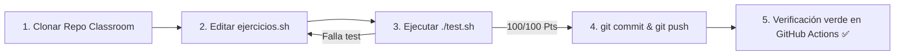

# Trabajo Práctico N° 0: Introducción a Linux, Shell y Git

> **Universidad Católica de Santiago del Estero (UCSE)**  
> **Departamento Académico San Salvador (DASS)**  
> **Cátedra:** Sistemas Operativos II — Ciclo Lectivo 2026  
> **Equipo Docente:** Ing. María Fernanda Vázquez (Profesora Titular) | Ing. Fabio Damián Argañaraz Azua (Jefe de Trabajos Prácticos)  
> **Modalidad:** Individual / Autoevaluativo  

---

## 🎯 Objetivos de la Actividad

1. **Configurar el entorno de desarrollo:** Familiarizarse con la terminal **Git Bash** (o entorno Linux nativo/WSL) y el flujo de trabajo profesional con **Git** y **GitHub Classroom**.
2. **Comprender la filosofía UNIX:** Dominar los principios de diseño de sistemas tipo UNIX: *"programas modulares que hacen una sola cosa bien"*, *"en Linux todo es un archivo"* y la composición mediante **tuberías (`|`)** y **redirecciones (`>`, `>>`, `<`)**.
3. **Manejo de utilitarios estándar POSIX:** Utilizar herramientas fundamentales de procesamiento de texto y archivos (`mkdir`, `cd`, `ls`, `cat`, `head`, `tail`, `wc`, `grep`, `cut`, `sort`, `uniq`, `chmod`).
4. **Aprendizaje autónomo y CI/CD:** Probar soluciones en forma local con la suite de pruebas automatizada (`./test.sh`) y verificar la integración continua mediante **GitHub Actions**.

---

## 📂 Estructura del Repositorio

```text
TP0/
├── .github/
│   └── workflows/
│       └── classroom.yml          # Workflow de evaluación automática en GitHub Actions
├── datos/
│   ├── servidores.log             # Archivo de logs para ejercicios de filtros y tuberías
│   └── usuarios.csv               # Dataset CSV para extracción y ordenamiento
├── soluciones/                    # Carpeta de salida para los archivos generados
│   └── .gitkeep
├── ejercicios.sh                  # ARCHIVO A EDITAR: Script con las funciones a completar
├── test.sh                        # Suite de pruebas local autoevaluativa
├── .gitignore                     # Configuración de exclusiones de Git
└── README.md                      # Enunciado e instrucciones de la actividad
```

---

## 🚀 Flujo de Trabajo Paso a Paso



### Paso 1: Configurar la identidad en Git (si es la primera vez)
Abra su terminal **Git Bash** y configure su nombre y correo institucional:
```bash
git config --global user.name "Su Nombre y Apellido"
git config --global user.email "su_correo@ucse.edu.ar"
```

### Paso 2: Clonar el repositorio
Clone el repositorio privado generado por GitHub Classroom en su computadora:
```bash
git clone https://github.com/UCSE-SO2-2026/tp-0-tu_usuario.git
cd tp-0-tu_usuario
```

### Paso 3: Resolver las consignas en `ejercicios.sh`
Abra el proyecto en su editor preferido (se recomienda **Visual Studio Code**) y complete el código dentro de cada función en el archivo [`ejercicios.sh`](./ejercicios.sh).

### Paso 4: Ejecutar la suite de pruebas local
En cualquier momento puede evaluar su progreso ejecutando:
```bash
./test.sh
```
> [!TIP]
> Si la terminal muestra error de permisos al ejecutar el script de pruebas, otorgue permisos de ejecución ejecutando una única vez:  
> `chmod +x test.sh ejercicios.sh`

### Paso 5: Confirmar y subir los cambios (Entrega)
Cuando `./test.sh` muestre **100 / 100 Pts**, confirme y envíe su solución a GitHub:
```bash
git add ejercicios.sh
git commit -m "Solución completa TP 0"
git push origin main
```
Luego ingrese a la pestaña **Actions** de su repositorio en GitHub para verificar que el workflow finalice con tilde verde (✅).

---

## 📋 Enunciado de los Ejercicios

### 🔹 Ejercicio 1: Navegación y Estructura de Directorios (20 Pts)
* **Objetivo:** Manipulación de directorios y creación de archivos.
* **Consignas:**
  1. Crear la siguiente estructura dentro de `soluciones/`:
     - `soluciones/entorno/config/`
     - `soluciones/entorno/logs/`
     - `soluciones/entorno/backup/`
  2. Crear un archivo vacío llamado `app.conf` dentro de `soluciones/entorno/config/`.
  3. Crear un archivo llamado `version.txt` dentro de `soluciones/entorno/config/` cuyo contenido sea exactamente:  
     `Sistemas Operativos II - 2026`

---

### 🔹 Ejercicio 2: Redirecciones y Conteo de Líneas (20 Pts)
* **Objetivo:** Uso de redirecciones de salida y utilitarios POSIX.
* **Consignas:**
  1. Extraer las **primeras 15 líneas** de `datos/servidores.log` usando `head` y guardarlas en `soluciones/primeros_15.log`.
  2. Contar la cantidad total de líneas de `datos/servidores.log` con `wc -l` y guardar **únicamente el número** en `soluciones/total_lineas.txt` (sin que aparezca la ruta del archivo).
  > **Pista:** `wc -l < archivo` redirige el contenido a la entrada estándar evitando que `wc` imprima el nombre del archivo.

---

### 🔹 Ejercicio 3: Tuberías y Filtros POSIX (20 Pts)
* **Objetivo:** Composición modular de comandos mediante pipes (`|`).
* **Consignas:**
  A partir del archivo `datos/servidores.log`:
  1. Filtrar las líneas que contengan el nivel de severidad `ERROR`.
  2. Extraer la segunda columna delimitada por espacios (la dirección IP).
  3. Ordenar las direcciones IP alfabéticamente y eliminar elementos duplicados.
  4. Redirigir el resultado a `soluciones/ips_con_error.txt`.

---

### 🔹 Ejercicio 4: Procesamiento de Datos Estructurados CSV (20 Pts)
* **Objetivo:** Procesamiento y extracción de columnas delimitadas por comas.
* **Consignas:**
  El archivo `datos/usuarios.csv` contiene el formato `ID,Nombre,Rol,Departamento,Activo`.
  1. Filtrar los usuarios que pertenezcan al departamento `Sistemas` y que tengan estado activo (`true`).
  2. Extraer solo el campo `Nombre` (columna 2).
  3. Ordenar los nombres alfabéticamente de la A a la Z.
  4. Guardar la lista en `soluciones/usuarios_sistemas_activos.txt`.

---

### 🔹 Ejercicio 5: Automatización y Permisos de Script (20 Pts)
* **Objetivo:** Creación de scripts ejecutables en Bash y gestión de permisos.
* **Consignas:**
  1. Crear un script en `soluciones/generar_reporte.sh` con el shebang `#!/usr/bin/env bash`.
  2. Al ejecutarse, debe imprimir por salida estándar:
     ```text
     === REPORTE DEL SISTEMA ===
     <fecha y hora generada con el comando date>
     Usuario: <nombre del usuario actual con whoami>
     ```
  3. Asignar permisos de ejecución al script (`chmod +x soluciones/generar_reporte.sh`).

---

## 🛠️ Preguntas Frecuentes y Solución de Problemas

> [!WARNING]
> **Fin de línea en Windows (CRLF vs LF):**  
> Si al ejecutar scripts en Git Bash visualiza errores como `\r: command not found`, configure Git para manejar finales de línea LF tipo UNIX:  
> `git config --global core.autocrlf input`

> [!IMPORTANT]
> **Criterio de Evaluación:**  
> La calificación del trabajo práctico es automática. Para obtener la aprobación de este trabajo práctico se requiere alcanzar **100 / 100 Pts** en la ejecución de `./test.sh` y contar con el workflow en verde en GitHub Actions.
